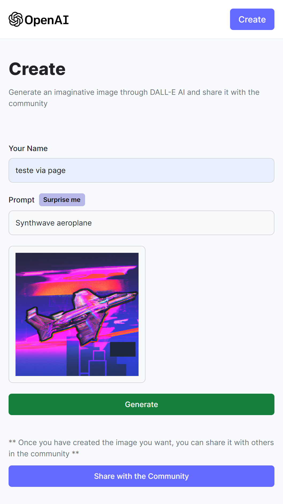

<h1 align="center">Pixel Dream - DALL-E Clone</h1>

  <a href="#-tecnologias">Tecnologias</a>&nbsp;&nbsp;&nbsp;|&nbsp;&nbsp;&nbsp;
  <a href="#-projeto">Projeto</a>&nbsp;&nbsp;&nbsp;&nbsp;&nbsp;&nbsp;</a>

 

<h2 align="center"> Web Preview </h2>

  

<h2 align="center"> Mobile Preview </h2>

  

## 🚀 Tecnologias

Esse projeto foi desenvolvido com as seguintes tecnologias:

- 💻Web Front end :

- [JavaScript](https://www.javascript.com/)
- [React](https://reactjs.org/)
- [Tailwind](https://tailwindcss.com/)
- [Vite](https://vitejs.dev/)

---

- ⚙️Back end :

- [Node.js](https://nodejs.org/en/)
- [Express](https://expressjs.com/pt-br/)
- [MongoDB](https://www.mongodb.com/)
- [Mongoose](https://mongoosejs.com/)
- [API DALL-E](https://openai.com/blog/dall-e/)
- [API Cloudinary](https://cloudinary.com/)

---

## 💻 Projeto

O Pixel Dream é um clone do DALL-E, um projeto de IA que gera imagens a partir de textos. Com a opção de compartilhar no feed da aplicação, onde todos podem ver as imagens geradas, baixar e até mesmo ver o prompt que foi usado para gerar a imagem para caso queira gerar a mesma imagem ou algo parecido.

#### Funcionalidades:

- [x] Gerar imagens a partir de textos
- [x] Compartilhar imagens geradas no feed
- [x] Procurar imagens geradas por outros usuários
- [x] Baixar imagens geradas

---

Feito com ♥ by Gustavo Batista :wave: [LinkedIn](https://www.linkedin.com/in/gustavo-h-batista/) e [GitHub](https://github.com/gustavohdab)
